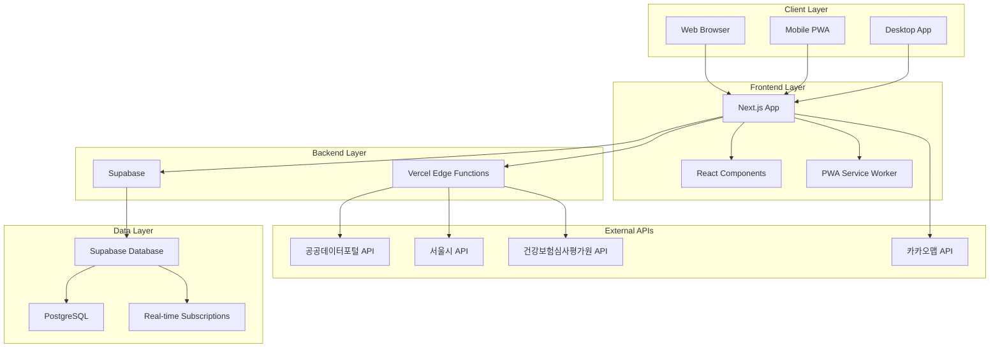
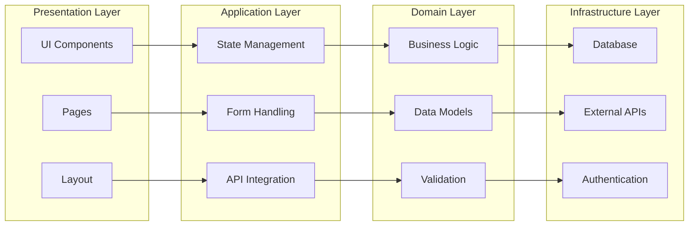
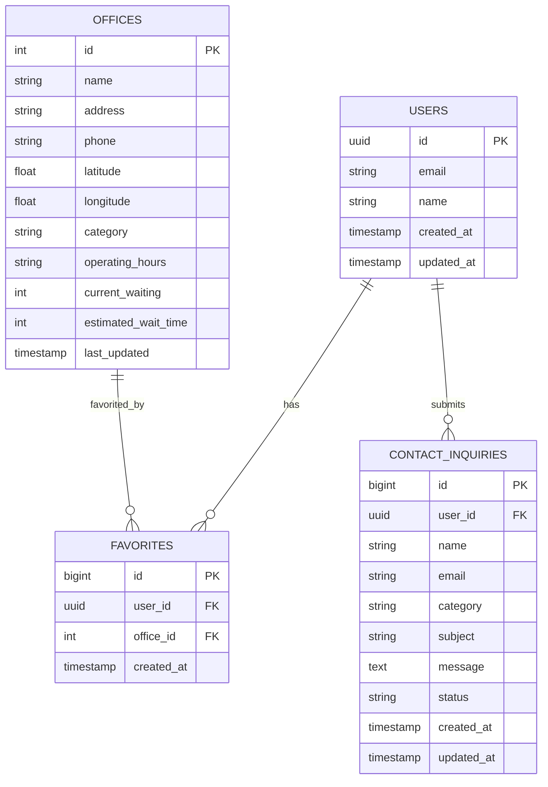
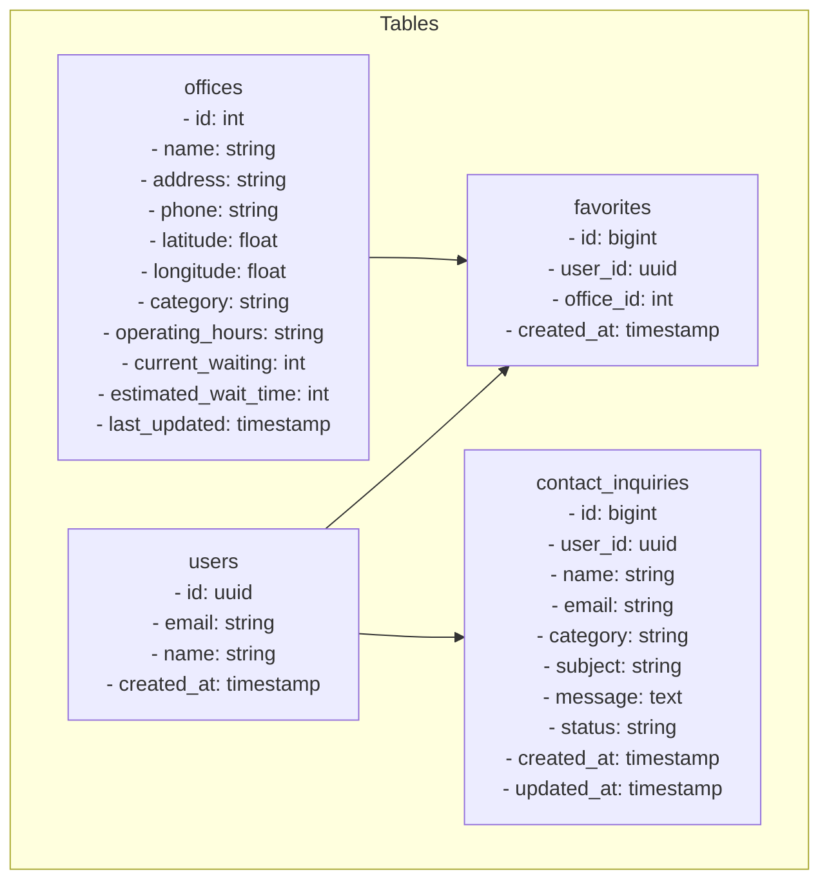
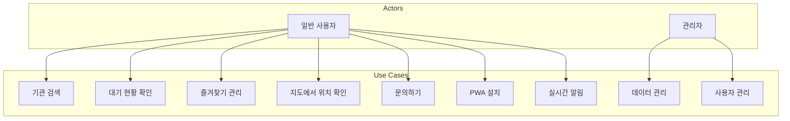
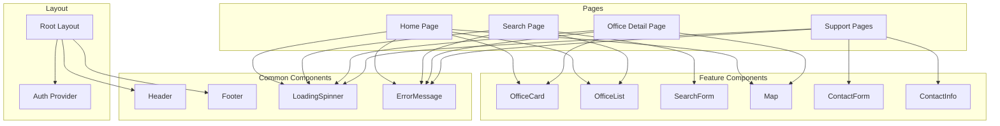
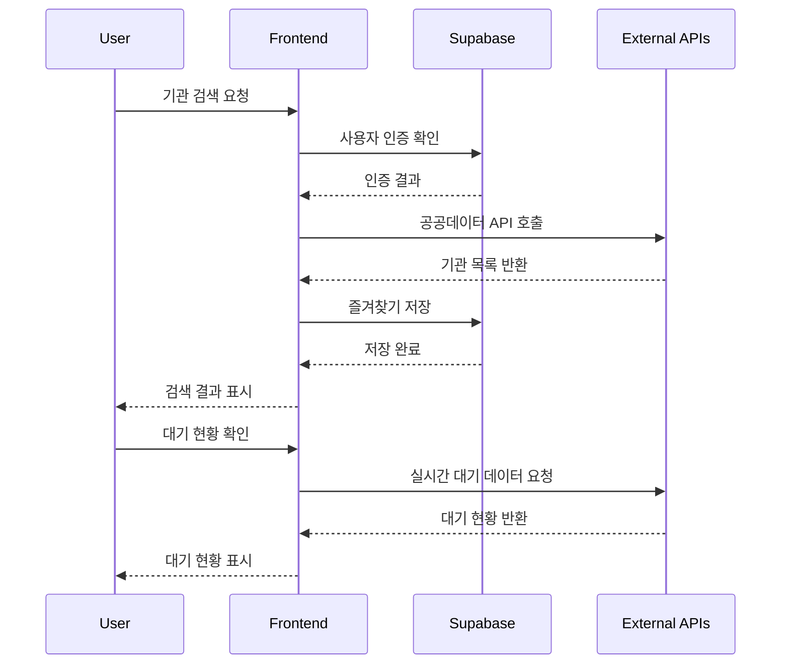
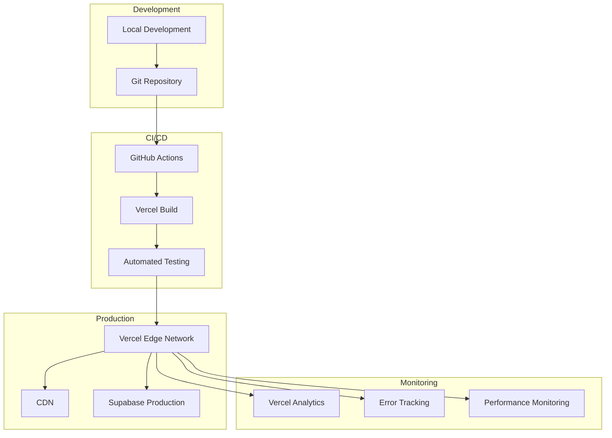
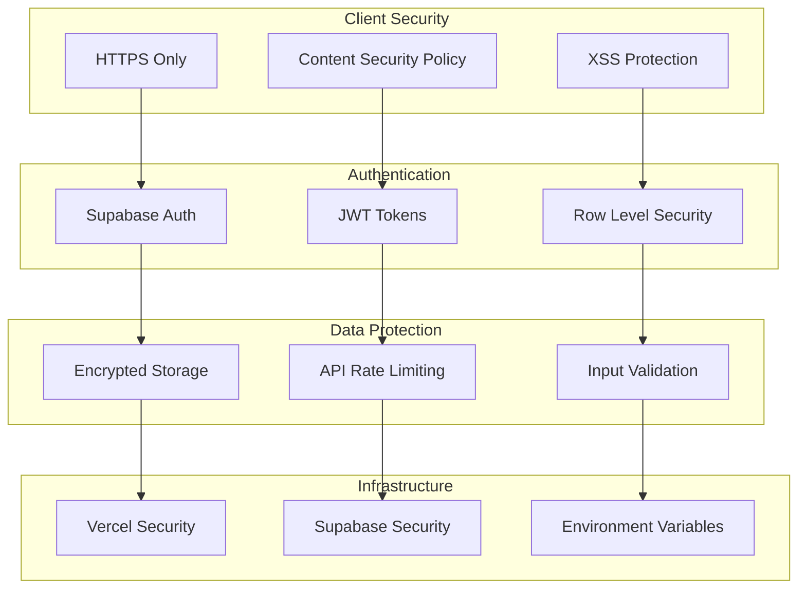

# MinwonQuick

공공기관 민원 대기 현황 실시간 안내 서비스

## 🏗 시스템 아키텍처

### 전체 시스템 아키텍처



### 서비스 아키텍처



## 📊 데이터베이스 모델링

### ERD (Entity Relationship Diagram)



### 데이터베이스 스키마



## 🎯 유스케이스 다이어그램



## 🔄 컴포넌트 아키텍처



## 🔌 API 아키텍처



## 🚀 배포 아키텍처



## 🔐 보안 아키텍처



## 🚀 주요 기능

- **실시간 대기 현황**: 기관별 현재 대기 인원 및 예상 대기시간 안내
- **위치 기반 정렬**: 사용자 위치 기준으로 가까운 기관 순 정렬
- **즐겨찾기**: 관심 기관 저장 및 관리
- **검색 기능**: 기관명/주소로 빠른 검색
- **지도 연동**: 카카오맵을 통한 위치 확인 및 경로 안내
- **PWA 지원**: 모바일 앱처럼 설치 및 오프라인 접근
- **실제 공공 데이터 연동**: 공공데이터포털 API를 통한 실시간 데이터

## 🛠 기술 스택

- **Frontend**: Next.js 15, TypeScript, Tailwind CSS
- **Backend**: Supabase (Auth, Database)
- **PWA**: next-pwa
- **지도**: 카카오맵 API
- **공공 데이터**: 공공데이터포털 API, 서울시 API
- **배포**: Vercel (권장)

## 📦 설치 및 실행

### 1. 프로젝트 클론
```bash
git clone <repository-url>
cd minwonquick
```

### 2. 의존성 설치
```bash
npm install
```

### 3. 환경변수 설정
`.env.local` 파일을 생성하고 다음 변수들을 설정하세요:

```env
# Supabase 설정
NEXT_PUBLIC_SUPABASE_URL=your_supabase_url
NEXT_PUBLIC_SUPABASE_ANON_KEY=your_supabase_anon_key

# 카카오맵 API 키
NEXT_PUBLIC_KAKAO_MAP_API_KEY=your_kakao_map_api_key

# 공공 데이터 API 키 (선택사항)
NEXT_PUBLIC_PUBLIC_DATA_API_KEY=your_public_data_api_key
NEXT_PUBLIC_SEOUL_API_KEY=your_seoul_api_key
NEXT_PUBLIC_HEALTH_API_KEY=your_health_api_key
```

### 4. 공공 데이터 API 키 발급 (선택사항)

#### 공공데이터포털 API 키 발급
1. [공공데이터포털](https://www.data.go.kr) 회원가입
2. "전국 병원 정보 조회 서비스" API 신청
3. 승인 후 발급받은 서비스 키를 `NEXT_PUBLIC_PUBLIC_DATA_API_KEY`에 설정

#### 서울시 API 키 발급
1. [서울시 열린데이터 광장](https://data.seoul.go.kr) 회원가입
2. "서울시 공공기관 정보" API 신청
3. 승인 후 발급받은 서비스 키를 `NEXT_PUBLIC_SEOUL_API_KEY`에 설정

#### 건강보험심사평가원 API 키 발급
1. [건강보험심사평가원](https://www.hira.or.kr) 회원가입
2. "병원 정보 조회 서비스" API 신청
3. 승인 후 발급받은 서비스 키를 `NEXT_PUBLIC_HEALTH_API_KEY`에 설정

### 5. Supabase 설정
1. [Supabase](https://supabase.com)에서 새 프로젝트 생성
2. 다음 테이블 생성:

```sql
-- 즐겨찾기 테이블
CREATE TABLE favorites (
  id BIGSERIAL PRIMARY KEY,
  user_id UUID REFERENCES auth.users(id) ON DELETE CASCADE,
  office_id INTEGER NOT NULL,
  created_at TIMESTAMP WITH TIME ZONE DEFAULT NOW()
);

-- 문의 테이블
CREATE TABLE contact_inquiries (
  id BIGSERIAL PRIMARY KEY,
  user_id UUID REFERENCES auth.users(id) ON DELETE SET NULL,
  name VARCHAR(100) NOT NULL,
  email VARCHAR(255) NOT NULL,
  category VARCHAR(50) NOT NULL,
  subject VARCHAR(200) NOT NULL,
  message TEXT NOT NULL,
  status VARCHAR(20) DEFAULT 'pending',
  created_at TIMESTAMP WITH TIME ZONE DEFAULT NOW(),
  updated_at TIMESTAMP WITH TIME ZONE DEFAULT NOW()
);

-- RLS 정책 설정
ALTER TABLE favorites ENABLE ROW LEVEL SECURITY;
ALTER TABLE contact_inquiries ENABLE ROW LEVEL SECURITY;

CREATE POLICY "Users can view their own favorites" ON favorites
  FOR SELECT USING (auth.uid() = user_id);

CREATE POLICY "Users can insert their own favorites" ON favorites
  FOR INSERT WITH CHECK (auth.uid() = user_id);

CREATE POLICY "Users can delete their own favorites" ON favorites
  FOR DELETE USING (auth.uid() = user_id);

CREATE POLICY "Users can view their own inquiries" ON contact_inquiries
  FOR SELECT USING (auth.uid() = user_id);

CREATE POLICY "Users can insert their own inquiries" ON contact_inquiries
  FOR INSERT WITH CHECK (auth.uid() = user_id);
```

### 6. 개발 서버 실행
```bash
npm run dev
```

브라우저에서 [http://localhost:3000](http://localhost:3000) 접속

## 🚀 배포

### Vercel 배포 (권장)
1. [Vercel](https://vercel.com)에 GitHub 저장소 연결
2. 환경변수 설정 (위의 환경변수들)
3. 자동 배포 완료

### 수동 배포
```bash
npm run build
npm start
```

## 📱 PWA 설치

1. 브라우저에서 서비스 접속
2. 주소창 옆 설치 아이콘 클릭 또는 브라우저 메뉴에서 "앱 설치" 선택
3. 모바일 앱처럼 홈 화면에 추가됨

## 🔧 API 연동

### 공공데이터 API 연동

#### 지원하는 API
1. **전국 병원 정보 조회 서비스** (건강보험심사평가원)
   - 병원 위치, 운영시간, 진료과목 정보
   - API 키: `NEXT_PUBLIC_PUBLIC_DATA_API_KEY`

2. **서울시 공공기관 정보** (서울특별시)
   - 서울시 소재 공공기관 상세 정보
   - API 키: `NEXT_PUBLIC_SEOUL_API_KEY`

3. **건강보험심사평가원 병원 정보** (건강보험심사평가원)
   - 실제 대기시간, 예상 대기시간 데이터
   - API 키: `NEXT_PUBLIC_HEALTH_API_KEY`

#### API 키 설정 방법
1. 각 API 제공기관에서 API 키 발급
2. `.env.local` 파일에 키 설정
3. 앱 재시작 후 실제 데이터 확인

#### Fallback 동작
- API 키가 설정되지 않은 경우: Mock 데이터 사용
- API 호출 실패 시: Mock 데이터로 자동 fallback
- 콘솔에서 API 상태 확인 가능

## 📁 프로젝트 구조

```
src/
├── app/                    # Next.js App Router
│   ├── auth-provider.tsx   # Supabase 인증 Provider
│   ├── layout.tsx         # 루트 레이아웃
│   ├── page.tsx           # 홈 페이지
│   ├── search/            # 검색 관련 페이지
│   └── support/           # 지원 페이지들
├── components/            # 재사용 컴포넌트
│   ├── common/            # 공통 컴포넌트
│   │   ├── Header.tsx
│   │   ├── Footer.tsx
│   │   └── index.ts
│   ├── contact/           # 문의 관련 컴포넌트
│   │   ├── ContactForm.tsx
│   │   ├── ContactInfo.tsx
│   │   ├── SuccessMessage.tsx
│   │   └── index.ts
│   ├── LoadingSpinner.tsx
│   ├── ErrorMessage.tsx
│   └── Map.tsx
├── lib/                   # 유틸리티 함수
│   ├── supabaseClient.ts
│   ├── fetchOffices.ts    # 공공 데이터 API 연동
│   ├── favorite.ts
│   └── contact.ts         # 문의 관련 함수
├── types/                 # TypeScript 타입 정의
│   └── office.ts
└── mock/                  # Mock 데이터
    └── offices.ts
```

## 🤝 기여하기

1. Fork the Project
2. Create your Feature Branch (`git checkout -b feature/AmazingFeature`)
3. Commit your Changes (`git commit -m 'Add some AmazingFeature'`)
4. Push to the Branch (`git push origin feature/AmazingFeature`)
5. Open a Pull Request

## 📄 라이선스

이 프로젝트는 MIT 라이선스 하에 배포됩니다.

## 📞 문의

프로젝트 관련 문의사항이 있으시면 이슈를 생성해주세요.
